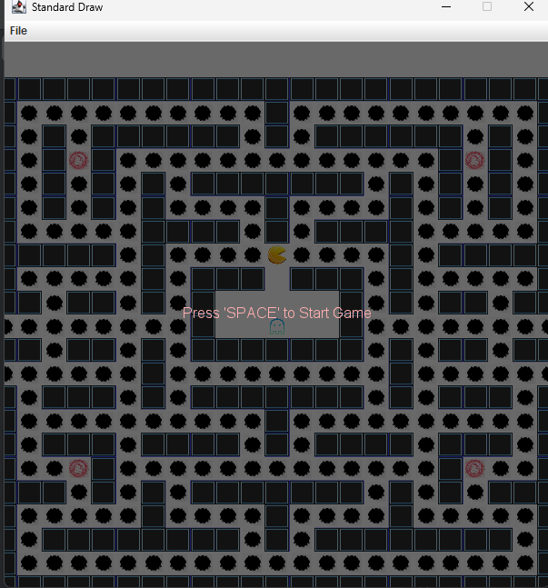

# Intro2CS_Ex3# 
Ex3 - Object-Oriented Programming & Gaming Aka: Pac-Man is “Going Places”

This is assigment #3 at Ariel University, School of Computer Science, 2026.

This assignment focuses on OOP, code reuse, and putting it all together (aka integration).

**note: i didn't create a jar and realeses because i have a problem with creating jars(I can't even open the jar that was given), another thing is in the video that was submmited in the forms i accidentaly said that higher difficulty means harder to win but it's the opssoite**
## ***Files***

*__How the algorithim works-__*
    the algorithm work in 3 different 'modes'

                1.eat pinks(pinks meaning food/ point)
                2.eat ghosts
                3. run from ghosts
                but before we go into specifics of the modes let's understand when each mode happens
                if pacman ate a green dot then there is no danger and pacman can eat everything and not fear any of the ghosts, so if pacman ate a green point(power pellet) and withing a distance(specified in the prameter.java file) from ghost he will enter eat ghosts mode
                but if pacman ate a green dot but he is far from the ghosts(more than the specified distance) than there is no reason for him to chase ghosts he will not reach, then he enters eat pinks 
                also if there is no ghost near pacman then there is no reason for pacman to fear so he also enter eat pinks mode(specified distance for danger is at parameters.java file)
            But if a ghost is within the specified distance of pacman than he is in danger of being eaten and enter run from ghosts mode.
                now lets go through how each mode works.(from the most simple)
                1.eat pinks - we call allDistance on pacman(see map2d interface for more information) and then we go through the all distance map and the original map and look for 1 in the all distance and compare with  3(pink points) or 5(green points) if we found a place where in the allDistance there is a one and in the original map there is 3 or 5 we call shortest-path there (see map2d interface) , if we didn't find we look for all distance 2 and so on until found, the function return 
                2.eat ghosts - here we have 2 main function the first one finds the closest ghost by going through all the ghosts and doing distance2d(look at pixel2d interface for more information) and returning the index2d of the ghost with the smallest distance from pacman, than the other function (closestGhost_path) which does shortestPath and returns the shortest path from pacman to the ghost
                3.run from ghosts - in order to run from the ghosts we need to decide where to run, in order to it we calculate 'Danger Score' for each possible move, meaning see what directions pacman can go and for each direction we calculate the danger score and the lowest danger score, the danger score is calculated with a few function the first one being calculate danger which calculates the danger of a move by calculating the distance form each ghost(using dis_from_ghost function) for each distance we add (1000.0 / ((distance * distance) + 1) to the total danger of the move,we multiply distance by distance to give more danger to closer points and +1 to not divide by zero, 
                                     after calculate Danger we call distToNearestGreen which returns the length of the shortestPath to the nearest Green point. 
                                     than to calculate the danger we totalDanger = -(ghostDanger * 5) - (greenDist*2); in order to give ghost danger more impact than distance from green, But we still have two cases we need to check so first we call isDeadEnd function which checks if the move will lead as to a dead end by checking if it is surrounded by walls(less than 3 wall means not a dead end),
                                      if it is a deadEnd we give a penalty totalDanger -= 5000.0 in order for pacman not to prefer dead ends, and the second case is that pacman can stater a lot because right will be the best move and then left is the best move so he if will go left and right a few times, in order to stop this we add totalDanger += 5 which means pacman will favor going the same direction twice(this will eliminated some of the staters but not all of them).
                                       another thing that you may have noticed is that when we calculateDanger if a ghost is really close we get infinity, in order to not get infinity we totalDanger = -1000000.0*Parameters.min_distance so it will be a really small number instead of infinity.
                                      after we did all of this for every move we return teh direction with the highest danger(highest danger is actually lowest danger because we multiplied by -1)
                after we have all the modes and functions, we need a function to move pacman so we use calculate_path which call all the function based on the state of pacman and then call followPath function which gets a path and return the first direction which pacman should go according to the path(index 1 at path, followPath takes the index 1 at path and check if it's to the left right up or down of pacman and return a direction based on that).

*__Interface-__*

    1. Pixel2D - an interface which represents an integer based cooridante.
    
    2. Map2D - an interface which represents a 2D map as a matrix or maze.

    3. Game - an interface which represents a game of pacaman.

    4. Ghost - an interface which represents a Ghost.

*__Classes-__*

    1. Index2D - represents a 2D point, implements Pixel2D.

    2. Map - represents a 2D map or maze as a 2D array of integers, implements Map2D

    3. StdDraw + StdAudio-  Standard drawing library. This class provides a basic capability for
    creating drawings with your programs. 
     (https://introcs.cs.princeton.edu/java/stdlib/StdDraw.java.html)

    4. MyGame - the main part of the server side a class that represents a game, and controls all the functions of the game.

    5. MyGhost - all class that represents a ghost, controls all the functions of the ghosts in the game.

    6. new_algo + Ex3Algo - both files are the same in logic but little changes in order for each of them to work, new_algo works with part 3 of the assigment, the server side. more about how the algorithim works is written below

    7. ManualAlgo - algo for using keys to control pacman.

*__Tests-__*

    1. Index2DTest - includes all the  tests for Index2D.

    2. MapTest - includes all the tests for Map.

*__Mains-__*

    1. Ex3Main - main for the client side

    2. EX3_NEW_MAIN - main for the server side

*__Other-__*

    1. GUI - Graphical User Interface for the whole game.

    3. Parameter - holds a few Parameters that control how pacman moves.

    4. game_settings - controls the game(server side, part 3), has a few settings like difficult ect.

    5. GameInfo - settings for the client side
## ***Functions***
*__Index2D-__*
    
    1. Index2D(int w, int h) - the standard constructor.

    2. Index2D(Pixel2D other) - Copy constructor.

    3. getX() - returns the x value of the Index.

    3. getY() - returns the y value of the Index.

    4. distance2D(Pixel2D p2) - computes the 2D (Euclidean) distance between two points .

    5. toString() - returns a string representation of the Index[from the form of (x,y)].

    6. equals() - return true or false based on if two Indexes are equal.

*__Map-__*

    1. public Map(int w, int h, int v) - the standard constructor.
    
    2. public Map(int size) - constructor a square map with a width and height of size and each value is zero.

    3. public Map(int[][] data) - Constructs a map from a given 2D array of integers.

    4. init(int w, int h, int v) - Constructs a 2D array of ints, filled with a given value and turn it into a map.

    5. init(int[][] arr) - Constructs a 2D array of ints from a given array and turns it into a map.

    6. getMap() - returns a deep copy of the 2D array of integers that represents the map.

    7. getWidth() - returns the width of the current(this) map.

    8. getHeight() - returns the height of the current(this) map.

    9. getPixel(int x, int y) - returns the value of the map at the given coordinates.

    10. getPixel(Pixel2D p) - returns the value fo the map at the given Pixel2D p. 

    11. setPixel(int x,int y , int v) - sets the integer v to be the value of the map at the given coordinates x,y.

    12. setPixel(Pixel2D p, int v) - setst the sets the integer v to be the value of the map at the given Pixel2D p.

    13. isInside(Pixel2D p) - returns true or false based on if the given Pixel2D p is inside the map.

    14. sameDimensions(Map2D p) - return true of false based on if the given map has the same dimensions.

    15. addMap2D(Map2D p) - adds the values of the given map to the value of the current map.

    16. mul(double scalar) - multiplies each value in the map by the given scalar.

    17. rescale(double sx, double sy) - rescales the current map, rescales the height by sx and the width by sy, note that some values can be erased if you rescale.

    18. drawCircle(Pixel2D center, double rad, int color) - draws a circle of the given color inside the map, the circle will have the given Pixel2D center as the center and the given rad as the radius.

    19. drawLine(Pixel2D p1, Pixel2D p2, int color) - draws a line of the given color, the line will bet from the coordinates of Pixel2D p1 to the coordinates of Pixel2D p2.

    20. drawRect(Pixel2D p1, Pixel2D p2, int color) - draws a rectangle from the coordinates of Pixel2D p1 to the coordinates of Pixel2D p2, the rectangle will be of the given color.

    21. equals(Object ob) - if the given isn't an instanceof Map2D will automatically return false otherwise if it is return true or false based on if the given maps has the same dimensions and values as the current map.

    22. fill(Pixel2D xy, int new_v,  boolean cyclic) - returns the numbers of filled pixels when filling the map with the color of new_v from the coordinates of Pixel2D xy, takes into account if the map is cyclic or not.

    23. floodFill(Pixel2D xy, int new_v, int old_v, boolean cyclic) - returns the numbers of filled pixels when filling the map with the color of new_v from the coordinates of Pixel2D xy, takes into account if the map is cyclic or not, the diffrence from fill is that fill finds the color we want to fill and then calls this function, this function uses BFS to set every old color that connects, to the new color.

    24. shortestPath(Pixel2D p1, Pixel2D p2, int obsColor, boolean cyclic) - returns an array of Pixel2D that represents the shortest path to get from Pixel2D p1 to Pixel2D p2 when avoiding all the pixels that have the color obsColor, uses BFS to calculate the path.

    25. allDistance(Pixel2D start, int obsColor, boolean cyclic) - returns a map that the value of each pixel is it's number of steps in the shortest path from Pixel2D start, each None accessible entries are with marked -1, avoids the pixels of the color obsColor.

    26. new_fill(Pixel2D p1,Pixel2D p2,boolean cyclic) - works the same as fill + flood fill, the only difference is that now we count each step in each path , by saving in the queue its coordinates with their count, and it returns the number of steps it did until it got to p2 if it didn't make it to p2 return -1, uses BFS.

    27. find_path(int count, int x, int y, boolean cyclic) - return an array of Index2D that represents the path to reach from the maximum value in the map to zero, if there is no path return 01, uses BFS.

*__Ex3_algo + new_algo-__*

    Ghost Detection & Interaction:

    1.closestGhost: Identifies the nearest active ghost that isn't currently in the starting "spawn" area. Returns its coordinates.

    2.isGhost_in_start: A helper that checks if a specific ghost is currently located within the predefined starting rectangle coordinates.

    3.dis_from_ghost: Calculates the path distance between a specific point (usually Pacman’s next move) and a ghost

    Navigation & Movement

    4.closestPoint: Scans the board for the nearest collectible item (Pink or Green points) and returns the shortest path to reach it.

    5.followPath: Translates a calculated path (an array of pixels) into a specific integer direction (UP, DOWN, LEFT, RIGHT) for the next move, accounting for cyclic board wrapping.

    6.distToNearestGreen: Specifically calculates the distance to the closest "Green" point, used primarily to prioritize power-ups during escape maneuvers.

    7.isDeadEnd: Analyzes a potential coordinate to see if it leads to a dead end (a tile with only one entrance/exit) to prevent Pacman from being trapped.

    Decision Making

    8.eat_state: Determines if Pacman should switch to "hunting mode" based on whether ghosts are edible, their remaining edible time, and their proximity.

    9.run_state: Checks if Pacman is in immediate danger by measuring the distance to active, non-edible ghosts.

    10.eat_pink_state: A logic gate that returns true only if Pacman is currently safe (not needing to run or hunt ghosts), indicating he should focus on collecting points.

    11.calculate_path: The main controller function. It evaluates the current game state (Run, Eat, or Collect) and determines the final direction Pacman should move.(uses all the other functions)

    Risk Assessment & Evasion

    12.calculateDanger: Assigns a "danger score" to a potential move. It uses an inverse-square law where closer ghosts exponentially increase the danger value.

    13.run: The evasion algorithm. It evaluates all possible moves (Up, Down, Left, Right) and chooses the one with the lowest danger score, while avoiding dead ends and favoring paths toward green points.

*__MyGame-__*

    1.init: Sets up the initial game environment, including the map, Pacman's starting position, the list of ghosts, and configuration settings like cyclic mode and game speed (dt).

    2.getStatus: Tracks the current state of the game: 0 for Running, 1 for Won (all points collected), and -1 for Lost (Pacman eaten).

    3.checkIfWon: Iterates through the map to check if any "Pink points"  remain. If none are found, the game is marked as won.

    4.move(int direction): The primary logic gate for every "tick" of the game. It:
        Updates the game timer.
        Validates and executes Pacman's movement.
        Handles item collection (Pink points for score, Green points for power-ups).
        Manages ghost AI movement and respawn timers.
    
    5.Cyclic Navigation: Includes helper methods (up, down, left, right) that handle movement if _cyclic mode is enabled.

    6.checkEaten: Monitors the coordinates of Pacman and the ghosts,If Pacman hits a vulnerable ghost, the ghost is "killed," moved to the start point, and set to a dead state (status 0),If Pacman hits an active ghost, the game status changes to Lost.

    7.triggerEatable: Triggered when Pacman consumes a "Green point." It switches all active ghosts to a vulnerable state for a limited duration.

    9.play: The main entry point for the game execution,Sets up the GUI and the algorithm,Implements the "Press SPACE to Start" logic, ensuring the game remains paused until the user is ready,While the game is running, it continuously fetches the next move from the (new_algo), updates the game state via move(), and re-renders the GUI.

*__MyGhost-__*

    only has one main functin move.
    first checks if the ghost is dead if,the if the game time is below a certain time don'w move, decides how to run after pacman(one ghost runs after him using shortest path, and the other sometimes randomly move and sometimes do shortest path as well, based on the difficulty chosen.)

## ***Result***
This is how to clines side looks.

